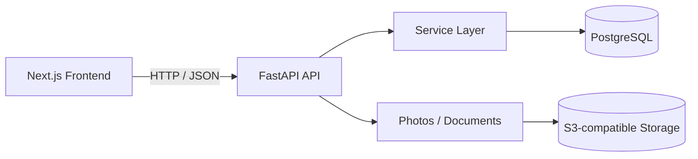

# Service Center Platform — Architecture

## Overview

Service Center Platform is a full-stack web application with a deliberately simple MVP architecture.



The frontend and backend are separate application layers in the same repository. The backend owns business rules and persistence; the frontend consumes the API for the operational user experience.

## Backend Layers

The backend follows:

```text
Router → Service → SQLAlchemy
```

**Routers** form the FastAPI HTTP boundary and delegate business behavior rather than carrying the main domain logic.

**Services** implement application and repair-workflow rules.

**SQLAlchemy Async** provides persistence to PostgreSQL, with Alembic managing schema migrations.

This separation also allows flows such as demo-data seeding to use the real service layer rather than duplicating business logic with raw database inserts.

## Authentication

Authentication is handled by the FastAPI backend, together with organization/user management.

The frontend contains public login/registration routes and an authenticated application area for operational pages.

The backend also applies in-memory rate limiting to the login endpoint. That choice matches the current single-process MVP; it is not designed as a distributed rate limiter.

## Frontend / Backend Separation

The frontend is a Next.js application under `frontend/`.

Its local configuration uses:

```env
NEXT_PUBLIC_API_BASE_URL=http://localhost:8000
```

Frontend API requests are built on that base URL and the backend's `/api/v1` routing convention.

The backend remains at the repository root under `app/`, with Docker Compose running the API and its local infrastructure.

## Database

PostgreSQL is the structured system of record.

It stores application data for the service workflow, including organizations/users, customers, equipment, repair jobs, assignments/status history, materials, additional work, payments, and metadata/relationships associated with documents and photos.

The backend uses asynchronous SQLAlchemy with `asyncpg`.

Local Docker development uses PostgreSQL 16.

## Object Storage

Photos and generated documents use S3-compatible object storage rather than storing binary payloads directly in PostgreSQL.

For local development, Docker Compose runs MinIO:

```text
MinIO API      http://localhost:9000
MinIO Console  http://localhost:9001
```

The application talks to storage through its S3 integration, while PostgreSQL retains the structured metadata and relationships needed by the product.

## Background Document Generation

PDF generation uses FastAPI `BackgroundTasks`.

The document task opens its own database session, generates the PDF, uploads it to S3-compatible storage, and persists the document/timeline information. Failure is logged and rolled back rather than partially committing the document record.

The current implementation therefore keeps document work outside the immediate request path without introducing separate worker infrastructure.

## Deliberate MVP Architecture Choices

The MVP does **not** use Redis or a separate queue worker.

That is intentional. The current background workload does not require durable queue state, distributed coordination, or automatic retry guarantees, so adding Redis/Celery/arq would increase operational complexity without being necessary for the implemented scope.

A queue-backed worker would become appropriate if the system later required guarantees such as durable retries or guaranteed scheduled execution. Those capabilities are not part of the current architecture.

The same principle applies across the system: use clear boundaries, but avoid distributed-system complexity before the product needs it.

## Local Architecture

Docker Compose currently provides:

```text
FastAPI        http://localhost:8000
PostgreSQL     localhost:5433
MinIO API      http://localhost:9000
MinIO Console  http://localhost:9001
```

The Next.js development server runs separately at:

```text
http://localhost:3000
```

This keeps the frontend development workflow independent while preserving a straightforward local backend stack.
